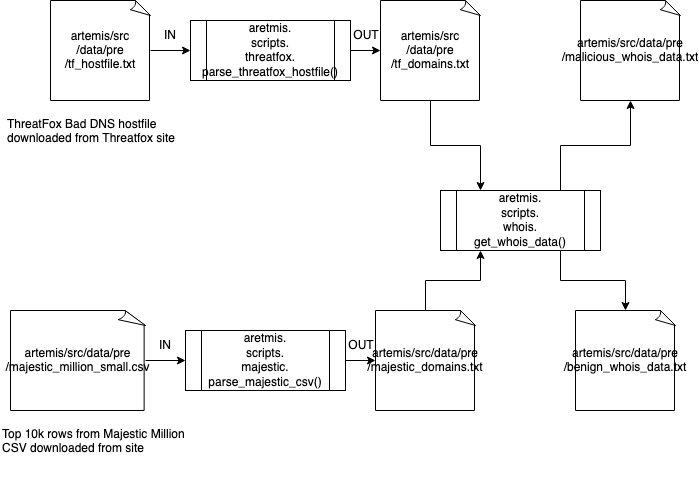

Artemis
==============================

Every day, threat actors utilize internet domain names to facilitate their malicious activity. This activity includes command and control (C2) of compromised infrastructure, exfiltration of sensitive data, and the delivery of malicious payloads via common internet technologies. The domain names involved in these campaigns are either specifically registered by the threat actor for a malicious purpose or are legitimate assets that have been compromised with the intent of exploiting that legitimacy to evade detection and fool unsuspecting victims. Our goal is to collect publicly available data and attempt to predict the probability that an internet domain name will be used for malicious purposes, what malicious activity the domain name facilitates, and which threat actor is most likely to carry out that activity. 

Project Organization
------------

    ├── LICENSE
    ├── Makefile           <- Makefile with commands like `make data` or `make train`
    ├── README.md          <- The top-level README for developers using this project.
    ├── data
    │   ├── external       <- Data from third party sources.
    │   ├── interim        <- Intermediate data that has been transformed.
    │   ├── processed      <- The final, canonical data sets for modeling.
    │   └── raw            <- The original, immutable data dump.
    │
    ├── docs               <- A default Sphinx project; see sphinx-doc.org for details
    │
    ├── models             <- Trained and serialized models, model predictions, or model summaries
    │
    ├── notebooks          <- Jupyter notebooks. Naming convention is a number (for ordering),
    │                         the creator's initials, and a short `-` delimited description, e.g.
    │                         `1.0-jqp-initial-data-exploration`.
    │
    ├── references         <- Data dictionaries, manuals, and all other explanatory materials.
    │
    ├── reports            <- Generated analysis as HTML, PDF, LaTeX, etc.
    │   └── figures        <- Generated graphics and figures to be used in reporting
    │
    ├── requirements.txt   <- The requirements file for reproducing the analysis environment, e.g.
    │                         generated with `pip freeze > requirements.txt`
    │
    ├── setup.py           <- makes project pip installable (pip install -e .) so src can be imported
    ├── src                <- Source code for use in this project.
    │   ├── __init__.py    <- Makes src a Python module
    │   │
    │   ├── data           <- Scripts to download or generate data
    │   │   └── make_dataset.py
    │   │
    │   ├── features       <- Scripts to turn raw data into features for modeling
    │   │   └── build_features.py
    │   │
    │   ├── models         <- Scripts to train models and then use trained models to make
    │   │   │                 predictions
    │   │   ├── predict_model.py
    │   │   └── train_model.py
    │   │
    │   └── visualization  <- Scripts to create exploratory and results oriented visualizations
    │       └── visualize.py
    │
    └── tox.ini            <- tox file with settings for running tox; see tox.readthedocs.io

Creating the datafiles
--------
* Simple method of creating datafiles: 
  * python src/scripts/make_dataset.py data/raw data/processed

Data Generation
--------

* [Threatfox malicious hostfile](https://threatfox.abuse.ch/downloads/hostfile/)
* [Majestic Million CSV](https://downloads.majestic.com/majestic_million.csv)

### Adding DVC to the repo

- Initialised DVC (dvc init)
- Added data folder to dvc (dvc add data)
- Added remote tracking storage to the shared google drive/folder ( dvc remote add -d storage ####)
- Pushed the "raw" data to dvc remote
## To use it:

- install dvc (pip install dvc)
- Run: dvc pull
- Authenticate to google drive if asked
- Check if data folder is there and has the raw subflder with files in it at least)

--------

<small>Project based on the <a target="_blank" href="https://drivendata.github.io/cookiecutter-data-science/">cookiecutter data science project template</a>. #cookiecutterdatascience</small>

